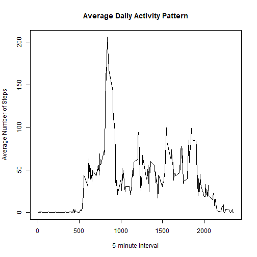
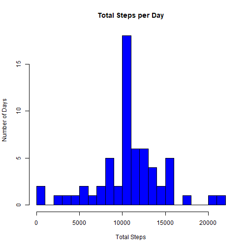

---
output:
  pdf_document: default
  html_document: default
---
# Daily footsteps activity analysis


This report analyzes daily step activity data from [Activity_monitoring_dataset](https://d396qusza40orc.cloudfront.net/repdata%2Fdata%2Factivity.zip)

The analysis explores patterns in daily movement, missing data handling, and differences between weekday and weekend activity.  
I will use R for data manipulation and visualization, as the main goal of this analysis is to become familiar with working in an **R Markdown** file.
 
## Loading the data
The variables included in this dataset are:

* **steps**: Number of steps taking in a 5-minute interval (missing  values are coded as NA)
* **date**: The date on which the measurement was taken in YYYY-MM-DD format
* **interval**: Identifier for the 5-minute interval in which measurement was taken


``` r
library(dplyr)
```


``` r
activity<-read.csv("activity.csv")
```

## What is the mean of the total number of steps taken per day?

I calculate the total daily steps by summing the data by date and visualize their distribution with a histogram to show daily activity patterns.


``` r
total_per_day<- activity %>%
    group_by(date) %>%
summarise(total_steps=sum(steps,na.rm = TRUE))
hist(total_per_day$total_steps,
     main = "Total Steps per Day",
     xlab = "Total Steps",
     ylab = "Number of Days",
     col = "blue",
     breaks = 20)
```


``` r
med<-median(total_per_day$total_steps)
m<-trunc(mean(total_per_day$total_steps))
```

The mean of the total number of steps taken per day is 9354 and median is 10395 


---


## What is the average daily activity pattern?

I calculate the average number of steps for each 5-minute interval across all days to explore daily activity patterns, highlighting the times of day when activity peaks.


``` r
avg_steps_interval <- activity %>%
        group_by(interval) %>%
        summarise(mean_steps= trunc(mean(steps,na.rm=TRUE)))

plot(avg_steps_interval$interval,avg_steps_interval$mean_steps,
     type = "l",                              
     xlab = "5-minute Interval",
     ylab = "Average Number of Steps",
     main = "Average Daily Activity Pattern")
```



``` r
max_interval<-avg_steps_interval$interval[which.max(avg_steps_interval$mean_steps)]
```

 The 5-minute interval, which on average across all the days in the data set contains the maximum number of steps is 835


---


## Imputing missing values


``` r
sum_NA<-sum(is.na(activity$steps))
```

Since the total number of missing values in the dataset is 2304, I address them by filling each missing step entry with the average count for the corresponding 5-minute interval before proceeding with further analysis.


``` r
activity_filled<-activity %>%
    left_join(avg_steps_interval, by = "interval") %>%
    mutate(steps=ifelse(is.na(steps), mean_steps,steps)) %>%
    select(steps,date,interval)
total_per_day_filled<- activity_filled %>%
    group_by(date) %>%
    summarise(total_steps=sum(steps,na.rm = TRUE))
hist(total_per_day_filled$total_steps,
     main = "Total Steps per Day",
     xlab = "Total Steps",
     ylab = "Number of Days",
     col = "blue",
     breaks = 20)
```



``` r
med_filled<-median(total_per_day_filled$total_steps)
m_filled<-trunc(mean(total_per_day_filled$total_steps))
```

After imputing missing values,
the new mean of the total number of steps per day is 1.0749 &times; 10<sup>4</sup> (previously 9354),
and the new median is 1.0641 &times; 10<sup>4</sup> (previously 10395).
**Filling NAs with interval averages isn’t fully rigorous, but it’s sufficient for the purpose of this simple analysis.**


---


## Are there differences in activity patterns between weekdays and weekends?

Finally, I examine whether activity patterns differ between weekdays and weekends by categorizing each day accordingly and calculating the average steps for each 5-minute interval in both groups.


``` r
activity_filled$date<-as.Date(activity_filled$date)
activity_filled$week<- ifelse(weekdays(activity_filled$date) %in% c("Monday","Tuesday","Wednesday","Thursday","Friday"),"weekday","weekend")
avg_week<- activity_filled %>%
    group_by(interval,week) %>%
    summarise(mean_steps=trunc(mean(steps,na.rm=TRUE)), .groups = "drop")
avg_weekday<- avg_week %>% 
    filter(week=="weekday")
avg_weekend<- avg_week %>% 
    filter(week=="weekend")
par(mfrow = c(2,1), mar = c(4,4,2,1), oma = c(0,0,4,0))
plot(avg_weekday$interval,avg_weekday$mean_steps,
     type = "l",                              
     xlab = "5-minute Interval",
     ylab = "Average Number of Steps",
     main = "Weekday")
plot(avg_weekend$interval,avg_weekend$mean_steps,
     type = "l",                              
     xlab = "5-minute Interval",
     ylab = "Average Number of Steps",
     main = "Weekend")
mtext("Average Steps per 5-Minute Interval: Weekdays vs Weekends",
      side = 3, outer = TRUE, line =1, cex = 1.5)
```


---

### Thank you for reviewing this analysis.
 *Apostolos Karyofyllis*
